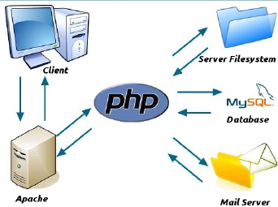

<style>
    #date {
        text-align:right;
    }

</style>
<p id="date">6/5/19</p>
<br />
<p id="date"><b>Course:</b> CSCI-A340</p>
<p><u><b>Table of Contents</b></u></p>

## <center><u>**Test 1 - Study Guide**</u></center>
### **Unit 1 - Introduction**
---
- The web, what is it? and how does it work?
- What is HTTP, HTTPS?

**Hyper Text Transfer Protocol (HTTP)**

**Hyper Text Transfer Protocol Secure (HTTPS)**

- What is HTML?

**Hyper Text Transfer Protocol (HTTP)**: a language for describing & creating web pages
- What is CSS?

**Cascading Style Sheet (CSS)**: used to control the "style & layout" of web documents. *Can be external or included in the HTML document*

Included in HTML document or as external CSS file.

_Internal_:
```html
<head>
    <style>
    </style>
</head>
```

- What is JavaScript?

**JavaScript**: a scripting language used to enhace the functionality & appearance of web pages
Executed by the browser but some browsers have it disabled.

_Internal_:
```html
<head>
    <script>
    </script>
</head>
```

- What is PHP?

**Hypertext Preprocessor (PHP)**: server-side scripting language used for web application logic
Based on C/C++ language

Open source

Can be embedded in HTML documents

Can also embed HTML tags and data

Web server needs a PHP interpreter to interpret the embedded PHP statements

When a client request a file with a ".php" extension, the web server sends the request to the PHP interpreter for pre-processing
PHP interpreter will interept the code adn return HTML back to the web server, which is then sent to the client


### **Unit 2 - HTML**
---
- What is `<!DOCTYPE>`?

Helps the browser identify and correctly display a web page

- What is DOM?

**Document Object Model (DOM)**: is an Application Programming Interface (API) for HTML & XML documents.

It defines a structure of the document, and how it can be accessed.

- What is a HEAD element? What elements are within HEAD?
```html
<title></title>
```
Provides metadata about the HTML document
```html
<meta charset="UTF-8">
<meta name="keywords" content="HTML, CSS, JavaScript, PHP">
<meta name="description" content="Web Programming">
<meta name="author" content="Seth Romanowski">
```
_Can be used by browsers, search engines, or other web services_
```html
<base>
```
```html
<style></style>
```
```html
<script></script>
```
```html
<link>
```

- Difference between an ELEMENT and an ATTRIBUTE
  
**Element**

Everything from the start tag to the end tag. 

Starts with a start tag and ends with an end tag.

Element content is everything between the start & end tag.

**Attribute**

- Difference between a BLOCK vs. INLINE element

**Block Elements**


**Inline Elements**

- Elements within a BODY element

### **Unit 3 - JavaScript**
---

Java vs. JavaScript
- **Java**
  - OOP language
  - Stand alone language and runs on a virtual machine
  - Compiled in a byte-code (an intermediate machine language) and produces a stand-alone executable
  - Object-oriented (Encapsulation, inheritance, polymorphism)
  - Strongly typed language
- **JavaScript**
  - Must be part of HTML document and runs within a browser
  - Interpreted line-by-line by the browser
  - Object-based: code uses builtin extensible objects but no classes or inheritance
  - Dynamically typed language

DOM vs. BOM
- **DOM**
  - Document Object Model (DOM) is an application programming interface (API) for HTML & XML
  - Organizes the entire web page as a document composed of a hierarchy of nodes like a tree structure and using the DOM API, nodes can be removed, added, and replaced
  - *DOM allows the developer to manipulate the document*
- **BOM**
  - Browser Object Model (BOM) allows access and manipulation of the browser window (i.e. browser history, location, navigator, and screen)
  - Each browser has its own implementation
  - *BOM allows the developer to manipulate the browser window*

**Built-in Objects**
- Array
- Boolean
- Date
- Math
- Number
- String
- RegExp
- Global


**Events**
HTML events are "things" that happen to HTML elements. When JavaScript is used in HTML pages, JavaScript can "react" on these events
- HTML Events
  - Ex. 
  - HTML web page is done loading
  - HTML input field was changed
  - HTML button was clicked
- Common HTML Events
  - onchange
  - onclick
  - onmouseover
  - onmouseout
  - onkeydown
  - onload
### **Unit 4 - CSS**
---
**Inline vs. External Style Sheets**
- **Inline**
```html
<p style='color:red'>This text is red</p>
```