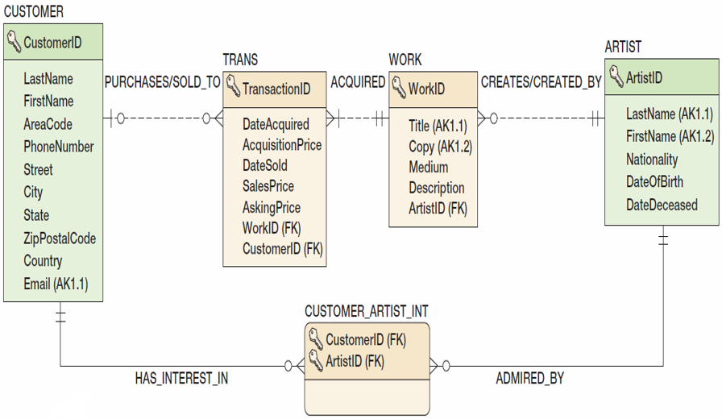

# P8

1. [Study](https://cisjw.sitehost.iu.edu/dbsguide/view-ridge-gallery.html)
- 3Cat1 - Schema DROP CREATE ALTER
- 3Cat2 - Create Table Column Constraints & Table Constraints
- 3Cat3 - Insert/Delete/Update/Truncate Rows in a Table

Task 23 - View Ridge Gallery
23.1 - Objectives
Data Definition Language (DDL)
- CREATE TABLE
- ALTER TABLE
- DROP TABLE
- TRUNCATE TABLE
Data Manipulation Language (DML)
- INSERT INTO
- UPDATE table
- DELETE from
CREATE/DROP View
Embed SQL in program code
- CREATE/DROP TRIGGER
- Stored Procedure/Persistent Stored Modules (SQL/PSM)
- CREATE PROCEDURE, CREATE FUNCTION

23.2 - Background Information
Transform to relational model in BCNF similar to the following diagram:
- TRANS table is a child table from many-to-many between CUSTOMER and WORK
- CUSTOMER_ARTIST_INT is a child table from many-to-many between CUSTOMER and ARTIST

23.3 - Implement
23.3.1.1 - CREATE & DROP SCHEMA
23.3.1.2 - Order of Table Creatio
During database creation, if we do not tempoorarily disable Foreign key constraint in MySQL, then the creation order matters if there are any FK in the database. The rule is:
*PARENT table must be create prior to its CHILD table*
23.3.2 - Statements
23.3.2.1 - CREATE TABLE
Each column is defined in three parts:
1. column name
2. data type
3. optional constraints
**Constraints**: can be defined within the CREATE TABLE statement.
- Alternatively, they can be added to the table after creation using the ALTER table statement
1. PRIMARY KEY
2. UNIQUE
3. NULL/NOT NULL
4. DEFAULT
5. CHECK
6. FOREIGN KEY
23.3.2.2 - DROP TABLE

23.3.2.3 - TRUNCATE TABLE
23.3.3 - Examples
23.3.3.1
23.3.3.2
23.3.3.3
23.3.3.4
23.3.3.5
23.3.3.6

23.4 - MANAGE Record
23.5 - USE vrg

1. [Study](https://cisjw.sitehost.iu.edu/dbsguide/sql-view-1.html)
- 3Cat4

Task 24 - SQL View
24.1 - Five Reasons
24.2 - SQL View
24.3 - Examples

3. [Study](https://cisjw.sitehost.iu.edu/dbsguide/sql-trigger.html)
- 3Cat5

Task 25 - SQL Trigger
25.1 - List Triggers
25.2 - Write Trigger