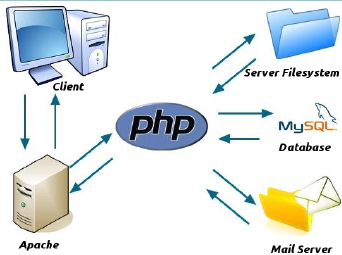

Network: a group of two or more computer systems linked together

Network Protocol: common set of rules and signals

Internet: global network of computers

IP Address:

IP Packets:

What is HTTP?
Hyper Text Transfer Protocol (HTTP): one of the transfer (data communication) protocols used in the WWW
HTTP session is a sequence of request-reponse transactions between a browser and a web server

| Request Methods | Description                                                                                                                                                 |
| --------------- | ----------------------------------------------------------------------------------------------------------------------------------------------------------- |
| GET             | Requests data from a specified resource (i.e. web server)                                                                                                   |
| HEAD            | Similar to GET request, but without the response body.                                                                                                      |
|                 | This is useful for retrieving meta-information written in response headers, without having to transport the entire content                                  |
| POST            | Requests that the server accept some data from the client                                                                                                   |
|                 | The data POSTed might be some data that is the result of submitting a web form                                                                              |
| PUT             | Similar to POST, but if the URI refers to an already exising resource, it is modified                                                                       |
|                 | If the URI does not point to an existing resource, then the server can create the resouce with that URI                                                     |
| DELETE          | Deletes the specified resource                                                                                                                              |
| TRACE           | Echoes back the received request so that a client can see what changes or additions have been made by intermediate servers                                  |
| OPTIONS         | Returns the HTTP methods that the server supports for specified URL                                                                                         |
| CONNECT         | Converts the request connection to a transparent TCP/IP tunnerl, usually to facilitate SSL-encypted communication (HTTPS) through an unencrypted HTTP proxy |
| PATCH           | Is used to apply partial modifications to a resource                                                                                                        |

Hyper Text Transfer Protocol Sercure (HTTPS): a SSL (secure socker layer) or TLS (Transport Layer Security) on top of the existing HTTP protocol
- Provides both authentication of the web server as well as bi-directional encryption between the client (web browser) and the web-server

What is HTML?
What is CSS?
What is client-side programming? What is JavaScript?
Used to enhance functionality and apperance of web pages

What is server-side programming? What is PHP?
PHP (Hypertext Preprocessor): server-side scripting language used for web application logic
- Based on C/C++ language
- Open source
- Can be embedded in HTML documents
- Can also embed HTML tags and data
- Web server needs a PHP interpreter to interpret the embedded PHP statements

How Does PHP Work?
When a client request a file with a ".php" extension, the web server sends the request to the PHP interpreter for pre-processing
PHP interpreter will interept the code adn return HTML back to the web server, which is then sent to the client

What is the difference between a static and a dynamic web page?

Client-Side vs. Server-Side
- PHP is code that is executed (interpreted) on the server, it generates HTML, which is then sent to the client
- The client (browser) would receive the results of running that script but would not know what the underlying code was