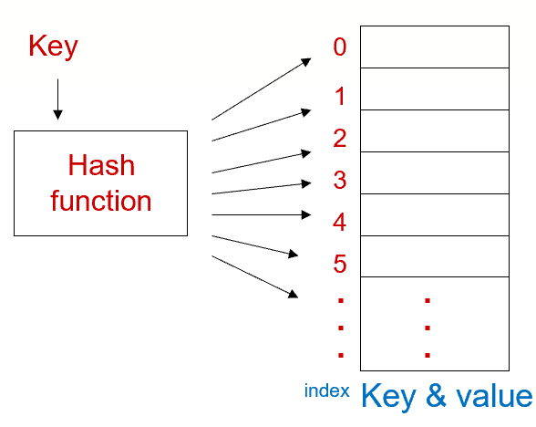
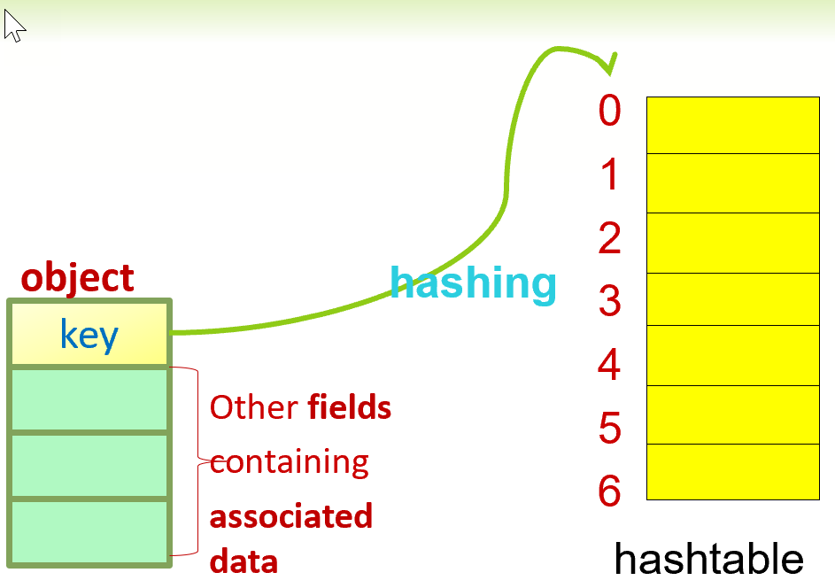

## **HW09**

**Hashing**: a technique used to store &/or access elements in an array w/ a relatively constant amount of time O(1).

**Hashing Function**: a function which maps a large range of key values into a smaller range of physical addresses

Assignment:
- Build hash tables to store the following account object in which,
  - account_number is an int
  - name is a String
  - balance is a double

1. Hash Table:
  
  - Must be dynamically allocated
  - The constructor for the hash table should be able to accept an integer (n>=2) parameterand creates a hash table such that the size of the table is equal to the next prime number (N) which is greater than (n)

2. Hash Function:

- A hash function is used to product a semi-unique address for a given **key** to be stored in the hash table.
- In this project, account_number and name are used together as a composite key.
  - **Hash code map** (key --> integer): account_number + summation of ASCII values of each character in string name
    - To cast a char C to an int j, you can use: int j = (int) C;
  - **Compression map** (integer --> [0, N-1]): i = integer % N
    - (i is the index of the hash table the account will be hashed into)

3. Collision Resolution:

- Despite our best effort in selecting a good hash function, often multiple keys could hash into the same hash table location
  - In such cases, we must be able to deal with the collision.
  - For the purpose of this assignmnet, we are required to use **chaining collision resolution method** w/ an **unsorted linked list**


4. The program should contain three classes
   1. account class - the node in the linked list
   - _class has been provided_
   2. hashtable class - contains an array *account*
   3. test class
   - _class has been provided_


5. Constructor of the hashtable class


6. The structure of the hash table


7. The hashtable class should also support the following operations
   1. Insert an account
   2. Remove an account
   3. Search an account


8. Test the program to make sure it is implemented correctly


Submission: hashtable.java


## **Hash Table**

- **Table Operations**
1. Insert: make sure the table does not contain another object w/ the same key
2. Find/Acess: retrieve the object in the table corresponding to a particular key
3. Remove: delete the object in the table that corresponds to a given key

- **Table Implementations**
1. Array (Direct Access Table)
   - Key id directly mapped to a position
   - Element whose key *k* is obtained by indexing into the *kth* position of the array
2. Linked List
3. Tree
4. Hash Table

- **Table Implementation: Unsorted Array**
1. Use a regular unsorted array
2. Insert: 
3. Access:
4. Remove:

- **Table Implementation: Sorted Array**
1. Insert:
2. Access:
3. Remove:

- **Table Implementation: Sorted Linked List**
1. Keep the objects in an ordered linked list
2. Insert:
3. Access:
4. Remove:
5. Find minimum - maximum: O(1)

- **Table Implementation: Unsorted Linked List**
1. Insert:
2. Access:
3. Remove:
4. Find minimum - maximum: O(n)


- **Table Implementation: Binary Search Tree**
1. Keep the objects in a binary search tree
2. Best case and average case (conditions apply) -
   1. Insert: $O(log_2(n))$
   2. Remove: $O(log_2(n))$
   3. Search: $O(log_2(n))$

- **Hashing Implementation of Table: Hash Table**



### Functions
- insert
- remove
- search

## HashTable - How-To
- **Using HashTable**
1. Create a hashtable, an array of target data type
2. Use hash function to convert the key of the object into an index of the hashtable array
3. Insert, remove, or search an object
   


- Hash Function
  

  
  - Simple Example of Hash Function
  - Popular Hosh-Code Maps
  - Popular Compression Maps
- Selecting Table Size
- Issues in Hashing
- Methods of Resolution
  - Seperate Chaining
    - Seperate Chaining Structure
  - Open Addressing
    - Linar Probing
    - Quadratic Probing
    - Double Hashing


Collisions


## Summary of Data Structures:
- Low level data structures
  - Regular array
  - Linked list
  - Binary search tree
  - Hash table
- High level data structure
  - Stack
  - Queue
  - Vector (list)
  - Set
  - map (table/dictionary)

## **Hash Table: Hash Function**


## **Hash Table: Collision Resolution**

Algorithm Complexity Analysis
Rule 1

Rule 2 - $log^k(n) = O(n)$ for any k
- The log grows very slowly
- **Important fact**: $log(x)$ grows extremely slowly, much slower than any linear function of x, even slower than x^1/2

**Computing the Complexity of a Program**

**Computing the Complexity**
- For a loop, it's at most the complexity of the statements inside the loop (including test conditions) multiplied by the number of iterations

What is the complexity of this function?
```cpp
int sum(int n)
{
  int partialSum = 0;
  for(int i = 1; i <= n; i++)
    partialSum = partialSum + i*i*1
  return partialSum
}
```
$O(n)$

- For a nested loop, the complexity of the inside statements times the product of the number of iterations for each loop

What is the complexity of the following code?
```cpp
int k = 0;
for(int i = 0; i < n; i++)
  for(int j = 0; j < n; j++)
    k = k+1;

```

$O(n^2)$

- For consecutive statements, these just add, which means the maximum one is the one that counts

What is the complexity of the following code?
```cpp
int k = 0;
for(int i = 0; i < n; i++)
  k = k + 1;
for(int i = 0; i < n; i++)
  for(int j = 0; j < n; j++)
    k = k+1;
```

$O(n^2)$

- For a conditional, it's the maximum between the complexity of the test, the complexity of the statement on the positive case and the complexity of the statements on the else.

```cpp
if(condition) // T1(n) = O(f(n))
  S1          // T2(n) = O(g(n))
else
  S2          // T3(n) = O(h(n))
```

$T(n) = O(f(n)) + O(g(n)) + O(h(n))$
-  $=Max(f(n), g(n), h(n))$

**Complexity of Recursion Functions**

```cpp
long factorial(int n)
{
  if(n<=1)
    return 1;
  else
    return n*factorial(n-1);
}
```
- $T(n) = 2 + T(n-1); T(1) = 1$
- $T(n) = O(n)$

Examples
```cpp
int myf(int n)
{
  if(n==1) return 2;
  else
  {
    return myf(n-1) + myf(n-1);
  }
}
```
- $T(n) = C + 2*T(n-1); T(1) = 1$
- $T(n) = O(2^n)$

```cpp
void myfunction(int n)
{
  if(n==1) cout << "A";
  else myfunction(n/2);
}
```
- $T(n) = C + T(n/2); T(1) = 1;$
- $T(n) = O(log(n))$