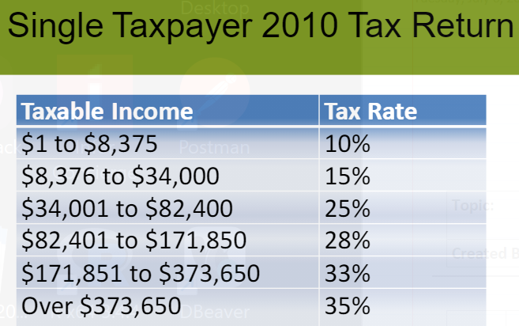

# **Exam 2 Review**

## **Ch. 3 - Preparing Your Taxes**
Understanding Federal Income Tax Principles
IRS
Economics of Income Taxes
Progressive Tax Struture
- Ex. Taxable Income & Tax Rate

Marginal Tax Rate
Average Tax Rate
Filing Status Categorires
- Single
- Married filling jointly
- Married filling seperately
- Head of household
- Qualifying widow/widower w/ dependent child

Your Take-Home Pay
Pay-as-you-go
Taxes include:
- Federal, State, & Local income taxes
- FICA and other withholding taxes

Taxable Income = the amount of income subject to taxes

Three Kinds of Income:
1. Active Income
2. Portoflio Income
3. Passive Income

Gross Income: any and all income subject to federal taxes

Taxable Income and Liability
Capital Gains
Adjustments to Gross Income
Deductions: Standardized or Itemized 
- Standard Deduction
- Itemized Deductions
Exemptions
Tax Credits
Tax Credits vs. Tax Deductions
Tax Forms and Schedules
Form 1040EZ
Other Filing Considerations
Tax Preperaton Services
Effective Tax Planning

## **Ch. 4 - Managing Your Cash and Savings**
