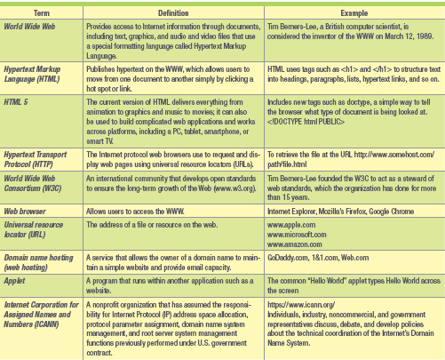
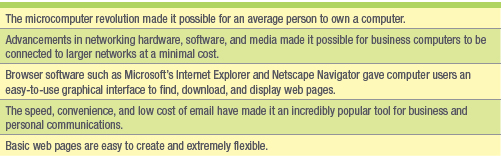
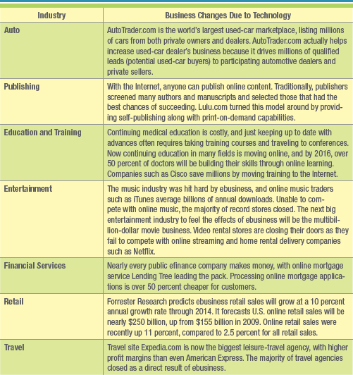
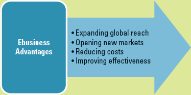
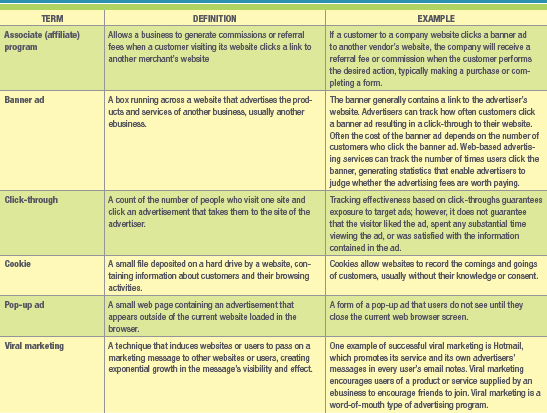
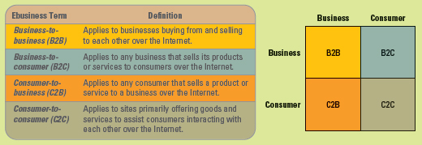
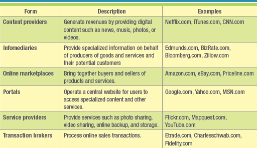
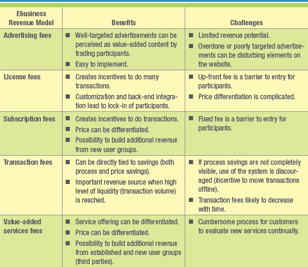

- [**Ch. 3: Ebusiness: Electronic Business Value**](#ch-3-ebusiness-electronic-business-value)
    - [**Learning Outcomes**](#learning-outcomes)
    - [**DISRUPTIVE TECHNOLOGY**](#disruptive-technology)
      - [**Disruptive vs. Sustaining Technology**](#disruptive-vs-sustaining-technology)
      - [**The Internet and World Wide Web — The Ultimate Business Disruptors**](#the-internet-and-world-wide-web--the-ultimate-business-disruptors)
    - [**WEB 1.0: THE CATALYST FOR EBUSINESS**](#web-10-the-catalyst-for-ebusiness)
      - [**Expanding Global Reach**](#expanding-global-reach)
      - [**Opening New Markets**](#opening-new-markets)
      - [**Reducing Cost**](#reducing-cost)
      - [**Improving Effectiveness**](#improving-effectiveness)
    - [**THE FOUR EBUSINESS MODELS**](#the-four-ebusiness-models)
      - [**Business-to-Business (B2B)**](#business-to-business-b2b)
      - [**Business-to-Consumer (B2C)**](#business-to-consumer-b2c)
      - [**Consumer-to-Business (C2B)**](#consumer-to-business-c2b)
      - [**Consumer-to-Consumer (C2C)**](#consumer-to-consumer-c2c)
      - [**Ebusiness Forms and Revenue-Generating Strategies**](#ebusiness-forms-and-revenue-generating-strategies)
    - [**EBUSINESS TOOLS FOR CONNECTING AND COMMUNICATING**](#ebusiness-tools-for-connecting-and-communicating)
# **Ch. 3: Ebusiness: Electronic Business Value**

As future managers and organizational knowledge workers, you need to understand the benefits ebusiness can offer an organization and your career, the challenges that accompany web technologies, and their impact on organizational communication and collaboration.

You need to be aware of the strategies organizations can use to deploy ebusiness and the methods of measuring ebusiness success. This chapter will give you this knowledge and help prepare you for success in tomorrow's electronic global marketplace.

### **Learning Outcomes**

3.1  Compare disruptive and sustaining technologies and explain how the Internet and WWW caused business disruption.

3.2  Describe ebusiness and its associated advantages.

3.3  Compare the four ebusiness models.

3.4  Describe the six ebusiness tools for connecting and communicating.

3.5  Identify the four challenges associated with ebusiness.

### **DISRUPTIVE TECHNOLOGY**
#### **Disruptive vs. Sustaining Technology**
- **Digital Darwinism**: implies that organizations that cannot adapt to the new demands placed on them for surviving in the information age are doomed to extinction.
- **Disruptive Technology**: a new way of doing things that initially does not meet the needs of existing customers. Disruptive technologies tend to open new markets and destroy old ones.
- **Sustaining Technology**: produces an improved product customers are eager to buy, such as a faster car or larger hard drive. Sustaining technologies tend to provide us with better, faster, and cheaper products in established markets. Incumbent companies most often lead sustaining technology to market, but they virtually never lead in markets opened by disruptive technologies
#### **The Internet and World Wide Web — The Ultimate Business Disruptors**
- **Internet**: a massive network that connects computers all over the world and allows them to communicate with one another. Computers connected via the Internet can send and receive information, including text, graphics, voice, video, and software

### **WEB 1.0: THE CATALYST FOR EBUSINESS**
- **Web 1.0 (or Business 1.0)**: is a term to refer to the World Wide Web during its first few years of operation between 1991 and 2003
- **Ecommerce**: is the buying and selling of goods and services over the Internet. Ecommerce refers only to online transactions
- **Ebusiness**: includes ecommerce along with all activities related to internal and external business operations such as servicing customer accounts, collaborating with partners, and exchanging real-time information
- **Paradigm Shift**: occurs when a new, radical form of business enters the market that reshapes the way companies and organizations behave

- **Ebusiness Disruption of Traditional Industries**:

- **Ebusiness Advantages**

#### **Expanding Global Reach**
- **Information Richness**: refers to the depth and breadth of details contained in a piece of textual, graphic, audio, or video information.
- **Information Reach**: measures the number of people a firm can communicate with all over the world
#### **Opening New Markets**
- **Mass Customization**: the ability of an organization to tailor its products or services to the customers' specifications
- **Personalization**: occurs when a company knows enough about a customer's likes and dislikes that it can fashion offers more likely to appeal to that person, say by tailoring its website to individuals or groups based on profile information, demographics, or prior transactions.
#### **Reducing Cost** 
- Chris Anderson, editor-in-chief of Wired magazine, describes niche-market ebusiness strategies as capturing the **long tail**, referring to the tail of a typical sales curve
- **Intermediaries**: are agents, software, or businesses that provide a trading infrastructure to bring buyers and sellers together
- The introduction of ebusiness brought about **disintermediation**, which occurs when a business sells directly to the customer online and cuts out the intermediary
- **Reintermediation**: steps are added to the value chain as new players find ways to add value to the business process
- **Cybermediation**: refers to the creation of new kinds of intermediaries that simply could not have existed before the advent of ebusiness, including comparison-shopping sites such as Kelkoo and bank account aggregation services such as Citibank
#### **Improving Effectiveness**
- **Interactivity**: measures advertising effectiveness by counting visitor interactions with the target ad, including time spent viewing the ad, number of pages viewed, and number of repeat visits to the advertisement

- Through **clickstream** data, they can observe the exact pattern of a consumer's navigation through a site. Clickstream metrics can include the length of stay on a website, number of abandoned registrations, and number of abandoned shopping carts

### **THE FOUR EBUSINESS MODELS**
- **Business Model**: a plan that details how a company creates, delivers, and generates revenues
- **Ebusiness Model**: a plan that details how a company creates, delivers, and generates revenues on the Internet
- **Dot-com**: was the original term for a company operating on the Internet

#### **Business-to-Business (B2B)**
- **Business-to-business (B2B)** applies to businesses buying from and selling to each other over the Internet. Examples include medical billing service, software sales and licensing, and virtual assistant businesses. B2B relationships represent 80 percent of all online business and are more complex with greater security needs than the other types. B2B examples include Oracle and SAP.
#### **Business-to-Consumer (B2C)**
- **Business-to-consumer (B2C)** applies to any business that sells its products or services directly to consumers online. Carfax offers car buyers detailed histories of used vehicles for a fee.
#### **Consumer-to-Business (C2B)**
- **Consumer-to-business (C2B)** applies to any consumer who sells a product or service to a business on the Internet. One example is customers of Priceline.com, who set their own prices for items such as airline tickets or hotel rooms and wait for a seller to decide whether to supply them. 
#### **Consumer-to-Consumer (C2C)**
- **Consumer-to-consumer (C2C)** applies to customers offering goods and services to each other on the Internet. A good example of a C2C is an auction where buyers and sellers solicit consecutive bids from each other and prices are determined dynamically.
#### **Ebusiness Forms and Revenue-Generating Strategies**

### **EBUSINESS TOOLS FOR CONNECTING AND COMMUNICATING**
