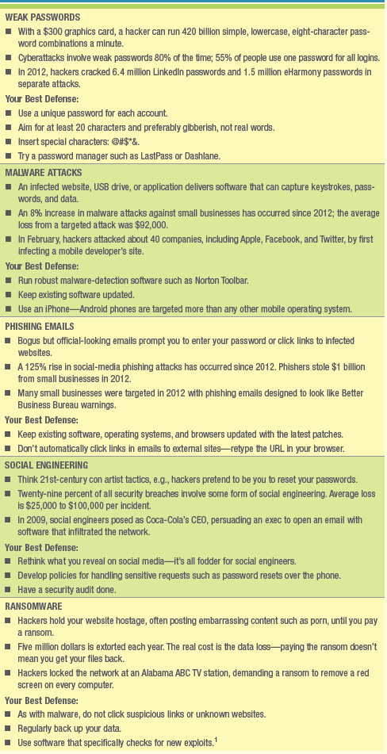
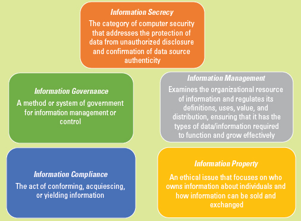
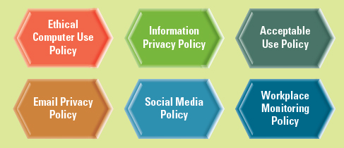

# **Ch.4: Ethics and Information Security: MIS Business Concerns**
You, the business student, must understand ethics and security because they are the top concerns customers voice today. The way they are handled directly influences a customer's likelihood of embracing electronic technologies and conducting business over the web—and thus the company's bottom line

## **INFORMATION ETHICS**
- Copyright: the legal protection afforded an expression of an idea
- Intellectual Property: intangible creative work that is embodied in physical form and includes copyrights, trademarks, and patents.
- Patent: an exclusive right to make, use, and sell an invention and is granted by a government to the inventor.
- Ethics: the principles and standards that guide our behavior towards other people.
- Privacy: the right to be left alone when you want to be, to have control over your personal possessions, and not to be observed without consent.
- Confidentiality: the assurance that messages and information remain available only to those authorized to view them.
- Information Ethics: govern the ethical and moral issues arising from the development and use of information technologies as well as the creation, collection, duplication, distribution, and processing of information itself (with or without the aid of computer technologies)
- Pirated Software: the unauthorized use, duplication, distribution, or sale of copyrighted software.
- Couterfeit Software: software that is manufactured to look like the real thing and sold as such.
- Digital Rights Management: a technological solution that allows publishers to control their digitial media to dscourage, limit, or prevent illegal copying and distribution.

### **Information Does Not Have Ethics, People Do**
- Ediscovery (Electronic Discovery): the ability of a company to identify, search, gather, seize or export digitial information in responding to a litigation, audit, investigation, or information inquiry.
- Child Online Protection Act (COPA): passed to protect minors from accessing inappropriate material on the Internet

## **DEVELOPING INFORMATION MANAGEMENT POLICIES**
- Epolicies: policies and procedures that address information management along with the ethical use of computers and the Internet in the business environment.

### **Ethical Computer Use Policy**
- Cyberbullying:
- Threat:
- Click-fraud:
- Competitive Click-fraud:
- Ethical Computer Use Policy:
- Bring your own device (BYOD):
### **Information Privacy Policy**