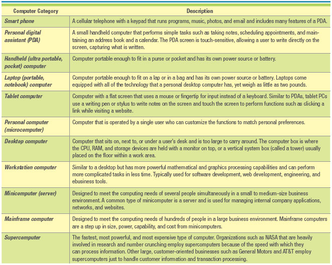
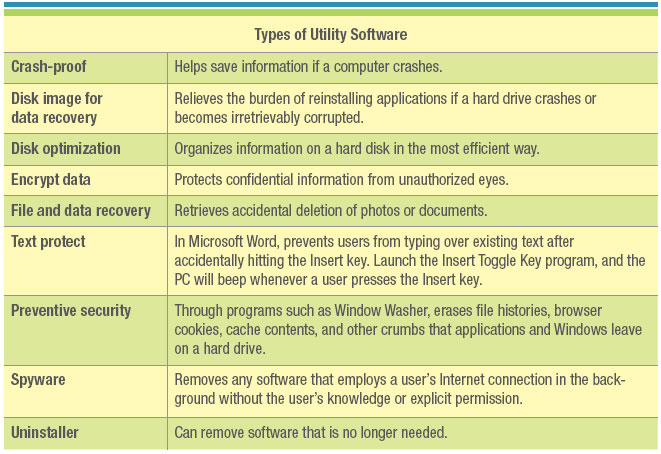

## **Appendix A: Hardware & Software Basics**

### **Introduction**

- **Hardware**: consists of the physical devices associated with a computer system.
- **Software**: the set of instructions that hardware executes to carry out specific tasks.

### **Hardware Basics**

- **Computer**: an electronic device operatings under the control of instructions stored in its own memory that can accept, manipulate, and store data.
- **Hardware & Software Overview**
  - **Hardware**
    - Central Processing
      - CPU: the computer's brain
      - RAM: integrated circuits, works with the CPU
    - Input Device
      - Keyboards, mouse, scanner
    - Output Device
      - Monitor, printer, headphones
    - Storage Device
      - DVD, memory stick, hard drive
    - Communication Device
      - Modem, wireless card
    - Connecting Device
      - Cables, USB port
  - **Software**
    - System SOftware: controls how the various tools work together with application software
      - Operating System Software
        - Windows, Mac OS, Linux
      - Utility SOftware
        - Antivirus, screen savers, data recovery
    - Application Software: performs specific information processing needs
      - Word Processing Software
        - Microsoft Word
      - Spreadsheet Software
        - Microsoft Excel

- **Central Processing Unit (CPU)**: the actual hardware that interprets and executes the program (software) instructions and coordinates how all other hardware devices work together.
  - Contains two primary parts:

1. **Control Unit** interprets software instructions and literally tells the other hardware devices what to do, based on the software instructions.
2. **Arithmetic-Logic-Unit (ALU)**: performs all arthimetic operations and all logic operations (such as sorting and comparing numbers).

- **Megahertz (MHz)**: the number of millions of CPU cycles per second
- **Gigahertx (GHz)**: the number of billions of CPU cycles per second
- **CPU Speed Factors**
  - Clock speed - the speed of the internal clock of a CPU that sets the pace at which operations proceed within the computer's 
  - Word length - number of bits that the CPU can process at any one time. 
  - Bus width - the size of the internal electrical pathway along which signals are sent from one part of the computer to another. A wider bus can move more data, hence produce faster processing
  - Chip line width - the distance between transistors on a chip. The shorter the chip line widht the faster the chip since more transistors can be placed on a chip and the data and the instructions travel shorter distances during processing.

- **Complex Instruction Set Computer Chips (CISC)**: a type of CPU that can recognize as many as 100 or more instructions, enough to carry out most computations directly
- **Reduced Instruction Set Computer Chips (RISC)**: limit the number of instructions the CPU can execute to increase processing speed
- **Primary Storage**:  the computer's main memory, which consists of the random access memory (RAM), cache memory, and read-only memory (ROM) that is directly accessible to the CPU.
- **Random Access Memory (RAM)**: the computer's primary working memory, in which program instructions and data are stored so that they can be accessed directly by the CPU via the processor's high-speed external data bus.
- **Volatility**: refers to a device's ability to function with or without power. RAM is volatile, meaning it must have constant power to function; its contents are lost when the computer's electric supply fails.
- **Cache Memory**: a small unit of ultra-fast memory stores recently accessed or frequently accessed data so that the CPU does not have to retrieve this data from slower memory circuits such as RAM.
- **Flash Memory**: a special type of rewritable read-only memory (ROM) that is compact and portable
- **Memory Cards**: contain high-capacity storage that holds data such as captured images, music, or text files.
- **Memory Sticks**: provide nonvolatile memory for a range of portable devices, including computers, digital cameras, MP3 players, and PDAs.
- **Secondary Storage**: consists of equipment designed to store large volumes of data for long-term storage.
- **Magnetic Medium**:  a secondary storage medium that uses magnetic techniques to store and retrieve data on disks or tapes coated with magnetically sensitive materials.
- **Magnetic Tape**: an older secondary storage medium that uses a strip of thin plastic coated with a magnetically sensitive recording medium.
- **Hard Drive**: a secondary storage medium that uses several rigid disks coated with a magnetically sensitive material and housed together with the recording heads in a hermetically sealed mechanism.
- **Optical Medium**:
  - Compact disk-read-only memory (CD-ROM) drive
  - Compact disk-read-write (CD-RW) drive
  - Digital video disk (DVD)
  - DVD-ROM drive
  - Digital video disk-read/write (DVD-RW)
- **Input Device**: is equipment used to capture information and commands
  - **Manual Input Devices**
    - Keyboard:
    - Mouse:
    - Touch Pad:
    - Touch Screen:
    - Pointng Device:
    - Game Computer:
  - **Automated Input Device**:
    - Image Scanner:
    - Bar Code Scanner:
    - Biometric Scanner
    - Opticsl Mark Reader:
    - Optical Character Reader:
    - Digital Still Camera:
    - Digital Video Camera:
    - Webcam:
    - Microphone:
    - Point-Of-Sale:
- **Adaptive Computer Device**:
- **Output Device**: 
  - **Monitors**:
    - Cathode-Bay Tube:
    - Liquid Crystal Display (LCD)
    - Light-Emitting Diode (LED)
    - Organic Light-Emitting Diode
  - **Printers**:
    - Ink-Jet Printer:
    - Laser Printer:
    - Multifunction Printer:
    - Plotter:
    - 3-D Printer:
- **Commmunication Device**: 

### **Computer Categories**:

  

### **Types of Utility Software**:

