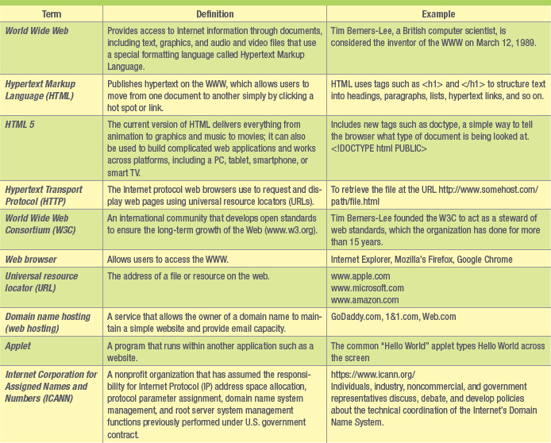

# **Ch. 3: Ebusiness: Electronic Business Value**

As future managers and organizational knowledge workers, you need to understand the benefits ebusiness can offer an organization and your career, the challenges that accompany web technologies, and their impact on organizational communication and collaboration.

You need to be aware of the strategies organizations can use to deploy ebusiness and the methods of measuring ebusiness success. This chapter will give you this knowledge and help prepare you for success in tomorrow's electronic global marketplace.

## **Learning Outcomes**

3.1  Compare disruptive and sustaining technologies and explain how the Internet and WWW caused business disruption.
3.2  Describe ebusiness and its associated advantages.
3.3  Compare the four ebusiness models.
3.4  Describe the six ebusiness tools for connecting and communicating.
3.5  Identify the four challenges associated with ebusiness.

### **DISRUPTIVE TECHNOLOGY**
#### **Disruptive vs. Sustaining Technology**
- **Digital Darwinism**: implies that organizations that cannot adapt to the new demands placed on them for surviving in the information age are doomed to extinction.
- **Disruptive Technology**: a new way of doing things that initially does not meet the needs of existing customers. Disruptive technologies tend to open new markets and destroy old ones.
- **Sustaining Technology**: produces an improved product customers are eager to buy, such as a faster car or larger hard drive. Sustaining technologies tend to provide us with better, faster, and cheaper products in established markets. Incumbent companies most often lead sustaining technology to market, but they virtually never lead in markets opened by disruptive technologies
#### **The Internet and World Wide Web — The Ultimate Business Disruptors**
- **Internet**: a massive network that connects computers all over the world and allows them to communicate with one another. Computers connected via the Internet can send and receive information, including text, graphics, voice, video, and software

