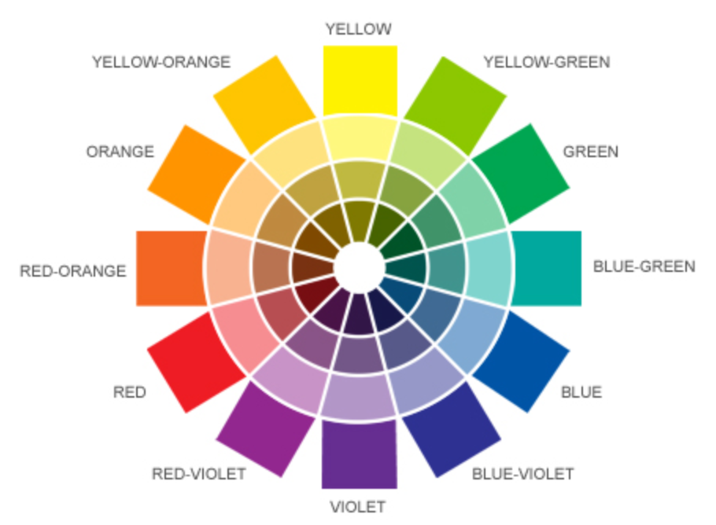

# **I310 Notes**
---

## **Color Logic**
- **Color**: the visual effect that is caused by the spectral composition of the light emitted, transmitted, or reflected by objects

### *How we see color*
Light goes from the source, to the object, and finally to the detector

_**Ex.**_
- Source: *The Sun* - all invisible colors of sunlight on the apple
- Object: *An Apple* - the surface of a red apple absorbs all the colored light rays, except for those corresponding to red, and reflects this color to the human eye 
- Detector: *The Eye* - the eye receives the reflected red light and sends a message to the brain
### _**Color Systems**_
- **Substrative Color**: Surface Color - an indirect mixture of reflected light
  - Results from the light they reflect after their surfaces absorb (or subtract) light rays
    - Black = all colors mixed
    - White = the absence of all color
- **Additive Color**: Light - a direct mixture of light
  - The eye receives the sum of light energies, the colored light, that exists in one place
    - Black = all colors mixed
    - White = the absence of all color
### _**Color Wheel**_


### **Primary, Secondary, Tertiary Colors**
- **Primary Colors**: 3 pigment colors that can not be mized or formed by any combination of other colors. All other colors are derived from these 3 hues
  - Red, Yellow, Blue
- **Secondary Colors**: colors formed by mixing the primary colors
  - Green, Orange, Purple
- **Tertiary Colors**: formed by mixing primary and secondary colors
  - Yellow-Orange, Red-Orange, Red-Purple, Blue-Purple, Blue-Green, Yellow-Green


## **Processing**
```java
line(1, 0, 4, 5);
```


```java
ellipse(50, 50, 80, 80);
```

"draw an ellipse, with the center 50 pixels over from the left and 50 pixels down from the top, with a width and height of 80 pixels."


```java
void setup() {
  size(480, 120);
}

void draw() {
  if (mousePressed) {
    fill(0);
  } else {
    fill(255);
  }
  ellipse(mouseX, mouseY, 80, 80);
}
```

Art Station - A drawing tool to aid developers

Extended Code Completion -  Extended code completion for statements like if, while and for etc.

Font Highlighting Editor - A visual editor for Processing's font coloring settings.

G4_ GUi Builder - Graphic design tool for creating user interfaces with G4P.

Getting Started - A Tool that provides a quick introduction to the PDE for new/beginner users.

Git Manager -  A GUI Git Client for Processing

Perceptual Color-picker -  Choose from 3 to 7 colors from CIE Lab or Lch with different graphic tools.

Reference Tool - A Tool that provides a built in reference for the 

Processing Development Environment.
Shape-Sketch - Paint on a canvas; generate processing code. Easy peasy!

Upload to Pi - Uploads and runs a sketch on a Raspberry Pi.