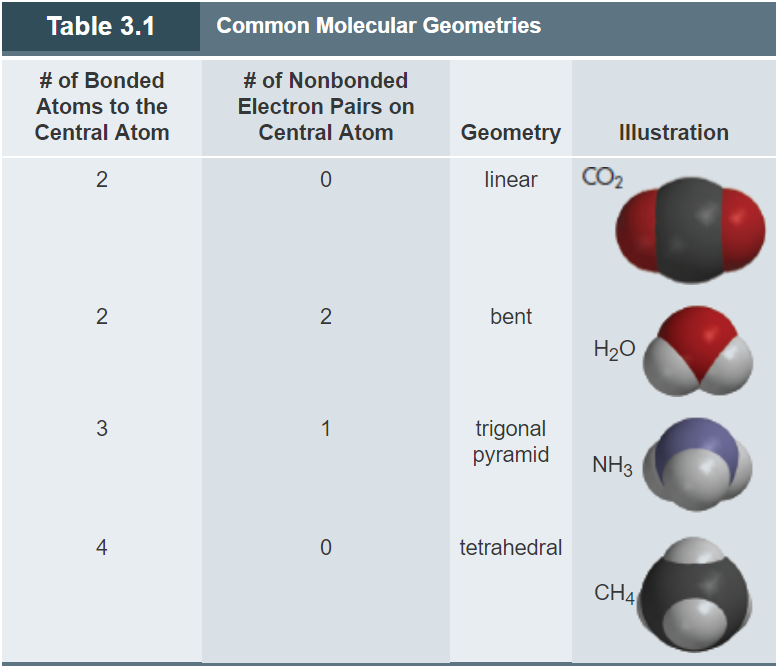

## **Ch. 3: The Chemistry of Global Climate Change**
### **In the Greenhouse: Earth's Enerygy Balance**
- Global Climate Change
- The Earth receives nearly all of its energy from the Sun primarily in the form of ultraviolet, visible, and infrared radiation.
- **Greenhouse Effect**: the natural process by which atmospheric gases trap a major portion(about 80%) of the infared radiation by the Earth
- **Greenhouse Gases**: gases capable of absorbing and emitting infared radiation, thereby warming the atmosphere.
  - Carbon dioxide
  - Water vapor
  - Methane
  - Nitrous oxide
  - Ozone
  - Chlorofluorocarbons
- The presence of those gases is essential in keeping our planet at habitable temperatures
- The exchange of energy between the Earth, atmosphere, and space results in a steady state and a continuous average temperature of the Earth. 
- The increase in concentration of greenhouse gases that is taking place today is changing the energy balance and causing increased warming of the planet
- **Enhanced Greenhouse Effect**: the process in which atmospheric gases trap and return more than 80% of the heat energy radiated by the Earth
- **Global Warming**: describes the increase in average global temperature that results from an enhanced greenhouse effect
- **Anthropogenic**: influences on the environment which stem from human activities such as industry, transportation, mining, and agriculture
  - These activities require carbon-based fuels, which produce carbon dioxide when burned
### **Gathering Evidence: The Testimony of Time**
- **Fossil Fuels**: combustible substances, of which coal, petroleum and natural gas are the most common
- Beginning about 1750, carbon dioxide began accumulating in the atmosphere at an ever-increasing rate, corresponding to the beginning of the Industrial Revolution and the accompanying combustion of fossil fuels that powered that transformation
### **Molecules: How They Shape Up**
- Opposite charges attract and like charge repel. Negatively charged electrons are attracted to positively charged nucleus. 
- However the electrons all have the same charge and therefore are found as far from eachother in space as possible while stil maintaining their attraction to the positively charged nucleus.
- **Procedure for Predicting the Shape of a Molecule**
  - Determine the number of outer electrons associated with each atom in the molecule
  - Arrange the outer electrons in pairs to satisfy the octet rule
  - Assume that the most stable molecular shape has the bonding electron pairs as far apart as possible
- Molecules are represented in different ways
  - Chemical formula, the simplest way
  - Lewis structure
- In some molecules, the central atom has nonbonding electron pairs, also called **lone pairs**
  - A nonbonding electron pair effectively occupies greater space than a bonding pair of electrons. 
  - Consequently, the nonbonding pair repels the bonding pairs somewhat more strongly than the bonding pairs repel one another.
  - This stronger repulsion forces the bonding pairs closer to one another
- The shape of a molecule is described in terms of its arrangement of atoms, not electrons

### **Vibrating Molecules and the Greenhouse Effect**
- How do greenhouse gases trap heat?
  - how molecules respond to photons of energy
    - UV-C (high-energy photons) break the covalent bonds in Ozone
    - UV-B (low-energy photons) break the bonds of oxygen
- Water is by far the most important gas in maintaining the Earth's temperature, followed by carbon dioxide
- Methane, nitrous oxide, ozone, and chlorofluorocarbons (such as $CCl_3F$) are among the other substances that help retain planetary heat.
- Highly energetic photons with high frequencies and short wavelengths (such as UV radiation) can break bonds within molecules. The less energetic photons (such as IR radiation) cause an increase in molecular vibration
- Another response of molecules to radiant energy is that longer wavelengths than those in the IR range have only enough energy to cause molecules to rotate faster.
  - For example, microwave ovens generate electromagnetic radiation that causes water molecules to spin faster
### **The Carbon Cycle**
1. Carbon is found in many places called resevoirs ex. atmosphere, rocks, plants & animals
2. Carbon moves from one resevoir to another ex. photosynthesis, combustion, sedimentation
3. Where carbon ends up ex. important for the benefit of humans today and in the future
- Respiration adds carbon dioxide to the atmosphere, and photosynthesis removes it. Similarly, the oceans both absorb and emit carbon dioxide
-  Widespread burning of coal for electricity production, of petroleum products for transportation, and of natural gas for home heating all transfer carbon from the largest underground carbon reservoir into the atmosphere.
### **Quantitative Concepts: Mass**
- **Atmoic Mass**: the mass (in grams) of the same number of atoms that are found in exactly 12 g of carbon-12
- **Avogadro's Number**: the number of atoms in exactly 12 g of C-12. Avogadro's number, if written out, is 602,000,000,000,000,000,000,000. It is more compactly written in scientific notation as 6.02 × $10^23$
- **To Find Average Mass**
  - Mass of Atom/Avogadro's Number (6.02 x $10^23$)
  - Ex. Oxygen 16.00 grams
    16.00 g/6.02 x $10^23$ oxygen atoms = 2.66 x $10^-23$ g oxygen/oxygen atom
### **Quantitative Concepts: Molecules and Moles**
- **Mole (mol)**: defined as containing an Avogadro's number of objects
  - Ex. 1 mol of carbon aroms consists of 6 x $10^23$ C atoms
- **Molar Mass**: the mass of Avogadro's number, or one mole, of whatever particles specified
  - Ex. a mole of Oxygen atoms has 16.0 g
- **Calculating Moles & Molar Mass**
  - Mole-to-Mass
    - Mass = # of Moles * Molar Mass
    - Ex. 1 mole of CO^2
      - C - 12.0 g
      - O - 16.0 g
      - Molar Mass = (1 * 12.0)+(2 * 16.0)
        - = 44.0 g
    - Ex. 3 moles of CO^2
      - = 44.0 * 3
      - = 132.0 g
  - Mass-to-Moles
    - # of Moles = Mass/Molar Mass
    - Ex. # of moles of Al present in 108 g of the element
      - Al - 27 g
      - # of Moles = 108/27
        - = 4 moles
### **Methane and Other Greenhouse Gases**
### **How Warm Will the Planet Get?**
### **The Consequence of Climate Change**
### **What Can (or Should) we Do About Climate Change?**