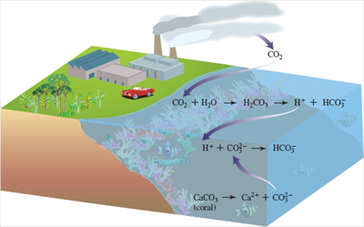

- [**Final Exam Review - N190**](#final-exam-review---n190)
  - [**Review Material**](#review-material)
    - [**Resources**](#resources)
    - [**Ch. 1: The Air We Breathe**](#ch-1-the-air-we-breathe)
    - [**Ch. 2: Protecting the Ozone Layer**](#ch-2-protecting-the-ozone-layer)
    - [**Ch. 3: The Chemistry of Global Warming**](#ch-3-the-chemistry-of-global-warming)
    - [**Ch. 4: Energy, Chemistry, and Society**](#ch-4-energy-chemistry-and-society)
    - [**Ch. 5: The Water We Drink**](#ch-5-the-water-we-drink)
    - [**Ch. 6: Neutralizing Acid Rain**](#ch-6-neutralizing-acid-rain)
    - [**Ch. 7: Nuclear Chemistry**](#ch-7-nuclear-chemistry)
  - [**Review Notes**](#review-notes)
    - [**Ch. 1: The Air We Breathe**](#ch-1-the-air-we-breathe-1)
    - [**Ch. 2: Protecting the Ozone Layer**](#ch-2-protecting-the-ozone-layer-1)
    - [**Ch. 3: The Chemistry of Global Warming**](#ch-3-the-chemistry-of-global-warming-1)
    - [**Ch. 4: Energy, Chemistry, and Society**](#ch-4-energy-chemistry-and-society-1)
    - [**Ch. 5: The Water We Drink**](#ch-5-the-water-we-drink-1)
      - [**Properties of Water**](#properties-of-water)
      - [**Aqueous Solutions**](#aqueous-solutions)
      - [**Solutes**](#solutes)
      - [**Solutions**](#solutions)
      - [**Names & Formulas of Ionic Compounds**](#names--formulas-of-ionic-compounds)
    - [**Ch. 6: Neutralizing Acid Rain**](#ch-6-neutralizing-acid-rain-1)
    - [**Ch. 7: Nuclear Chemistry**](#ch-7-nuclear-chemistry-1)

# **Final Exam Review - N190**
## **Review Material**
### **Resources**

**Solubility Chart**

| Elements              | Nitrate | Acetate | Chloride | Bromide | Iodide | Sulfate | Sulfide | Sulfite | Hydroxide | Phosphate | Carbonate |
|---------------------|---------|---------|----------|---------|--------|---------|---------|---------|-----------|-----------|-----------|
| Li, Na, K, Rb, Cs   | S       | S       | S        | S       | S      | S       | S       | S       | S         | S         | S         |
| NH4                 | S       | S       | S        | S       | S      | S       | S       | S       | S         | S         | S         |
| Be, Mg              | S       | S       | S        | S       | S      | S       | S       | I       | I         | I         | I         |
| Ca, Sr, Ba, Ra      | S       | S       | S        | S       | S      | I       | S       | I       | I         | I         | I         |
| Cu                  | S       | S       | I        | I       | I      | S       | I       | I       | I         | I         | I         |
| Ag                  | S       | I       | I        | I       | I      | I       | I       | I       | I         | I         | I         |
| Hg                  | S       | S       | S        | S       | S      | S       | I       | I       | I         | I         | I         |
| Hg(II)              | S       | S       | I        | I       | I      | S       | I       | I       | I         | I         | I         |
| Pb                  | S       | S       | I        | I       | I      | I       | I       | I       | I         | I         | I         |
| All others except H | S       | S       | S        | S       | S      | S       | I       | I       | I         | I         | I         |

### **Ch. 1: The Air We Breathe**
- [ ] Significant Figures
- [ ] Scientific Notation
- [ ] Periodic Table
- [ ] Atomic Structure
- [ ] Isotopes
- [ ] Calculating Average Isotopic Masses for Elements
- [ ] Balancing Equations

### **Ch. 2: Protecting the Ozone Layer**
- [ ] Lewis Dot Structures
- [ ] Electrons in First 36 Atoms
- [ ] Electrons in Atoms and Ions
- [ ] Covalent and Ionic Bonding
- [ ] ElectroMagnetic Spectrum

### **Ch. 3: The Chemistry of Global Warming**
- [ ] Balancing Equations
- [ ] Molecular Geometry
- [ ] ABE Patterns
- [ ] EM Radiation's Impact on Molecules
- [ ] Moles and Molar Masses

### **Ch. 4: Energy, Chemistry, and Society**
- [ ] Energy in Reactions
- [ ] Endo and Exothermic Reactions
- [ ] Catalyzed Reactions

### **Ch. 5: The Water We Drink**
- [ ] Structure of Water
- [ ] Solutions
- [ ] Solubility
- [ ] Like Dissolves Like
- [ ] Predicting Precipiation Reactions using Solutbility Chart
- [ ] Writing Complete Formula Equations and Net Ionic Formula Writing
- [ ] Naming Compounds

### **Ch. 6: Neutralizing Acid Rain**
- [ ] Characteristics of Acids and Bases
- [ ] Neutralization Reactions
- [ ] The General Meaning of pH
- [ ] Effect of CO^2 on ocean acidification
- [ ] SOx and NOx and Their Effects and Sources

### **Ch. 7: Nuclear Chemistry**

## **Review Notes**
### **Ch. 1: The Air We Breathe**
### **Ch. 2: Protecting the Ozone Layer**
### **Ch. 3: The Chemistry of Global Warming**
### **Ch. 4: Energy, Chemistry, and Society**
### **Ch. 5: The Water We Drink**
#### **Properties of Water**
- liquid at room temperature
- high boiling point, 100 deg C (212 deg F)
- when water freezes, it expands (*most liquids contract when they solidify*)
- **Unusual Properties Derive from the Molecular Structure**
  - Many of the unique properties of water are a consequence of its polarity.

$H_2O$
- Electrons not shared equally in the O-H covalent bond
- The oxygen atom attracts the shared electron pair more strongly than the hydrogen atom
  - *Oxygen has a higher electronegativity*
  - The electrons in an O-H bond are pulled closer to the more elctronegative oxygen atom

- **Electronegativity**: a measure of the attraction of an atom for an electron in a chemical bond
  - Scale - 0.7 to 4.0
  - **The greater the electronegativity, the more an atom attratcs the electrons in a chemical bond toward itself**
  - **The greater the difference in electronegativity between two bonded atoms, the more polar the bond is**
  - *Electronegativity values used to estimate bond polarities*
- **Polar Covalent Bond**: a covalent bond in which the electrons are not equally shared but rather are closer to the more electronegative atom
- **Nonpolar Covalent Bond**: a covalent bond in which the electrons are shared equally or nearly equally between atoms

To Predict if a Molecule is Polar - 2 Generalizations:
1. A molecule that contains only nonpolar bonds must be nonpolar
2. A molecule that contains polar covalent bonds may or may nore be polar
   
Ex. $H_2O$ - contains two polar bonds, and the molecule is polar
- Each H atom carries a partial positive charge (δ+), and the oxygen atom carries a partial negative charge (δ−)
- With these two polar bonds and a bent geometry, the water molecule is polar

#### **Aqueous Solutions**
- **Solvent**: Ex. water - a substance, often a liquid, that is capable of dissolving one or more pure substances
- **Solute**: solid, liquid, or gas that dissolves in a solvent
- **Aqueous Solution**: solutions in which water is the solvent
- **Concentration**: the ratio of a solute to the amount of the solution
- **Molarity (M)**: a concentration unit, and is a unit of concentration represented by the number of moles of solute present in 1 liter of solution
    - Molarity (M) = $moles of solute/liter of solution$
  - _The great advantage of molarity is that solutions of the same molarity contain exactly the same number of moles of solute and hence the same number of molecules (ions or atoms) of solute_

#### **Solutes**
- **Nonelectrolyte**: a solute that is nonconducting in an aqueous solution
- **Electrolyte**: a solute that conducts electricity in an aqueous solution
  - Ex. Sodium Chloride, NaCl
- **Ion**: an atom or group of atoms that has acquired a net electric charge as a result of gaining or losing one or more electrons
- **Cation**: a positively charged ion
- **Anion**: a negatively charged ion
- **Ionic Bond**: the chemical bondformed when oppositely charged ions attract
  - ionic bonding holds together a large assembly of ions
- **Ionic Compound**: composed of ions that are present in fixed proportions and arranged in a regular, geometric structure

Ex.
Na - Sodium, 11 electrons & 11 protons (1 valence electron)
  - Will lose an electron
- Na+, a cation, 11 protons & 10 electrons
  - 1+ charge
Cl - Chlorine, 17 electrons & 17 protons (7 valence electrons)
  - Will gain an electron
- (Cl-) Chloride Ion, 17 protons & 18 electrons
  - 1- charge
  
- The result is the aggregate of Na+ and Cl−, known as sodium chloride.
- In the formation of an ionic compound such as sodium chloride, the electrons are actually transferred from one atom to another, not simply shared as they would be in a covalent compound.

- Electron transfer to form cations and anions occurs between metallic elements and nonmetallic elements
  - Metals - strong tendency to give up electrons and form positive ions
    - Low electronegativity
  - Nonmetals - strong attraction for electrons and readily gain them to form negative ions
    - High electronegativity

- Salts
  - Ex. NaCl - table salt, ionic compound
- Sugars

#### **Solutions**
- Dissociation to form ions in solution
  - Ex. Sodium Chloride - NaCl
- Precipiation reactions (ppt) are double replacement reactions
- **Solubility Guidelines**:
1. Alkali Metals
2. 

- **Ionization**: a molecule with polar covalent bonds that is split into ions as it dissolves
  - Ex. Hyrodgen Chloride - HCl
- Electrolytes
  - Strong Electrolytes
    - Ex. NaCl, HCl
  - Weak Electrolytes
    - Ex. Vinegar
  - Nonelectrolytes
    - Ex. Sugar
- Colligative Properties

#### **Names & Formulas of Ionic Compounds**
*Naming*
- Ionic Compounds
  - Cation + Anion (ide)
    - Ex. $CaCl_2$ - Calcium Chloride
  - 1:1 - The prefixes *-mono*, *-di*, *-tri*, and *-tetra* are not used
- Ionic Compounds w/ Polyatomic Ions
  - Ex. Aluminum Sulfate - $Al_2(SO_4)_3$
  - 2:3 Ratio
    - 3 Sulfate Ions
  - **Cation is provided first**

- **Polyatomic Ion**: 
  - Ex. OH- Hydroxide Ion
    - Extra electron gives it a charge of 1-

### **Ch. 6: Neutralizing Acid Rain**
- **Acid**: a compound that releases hydrogen ions in aqueous solution
- **Strong Acid**: an acid that dissociates completley in aqueous solution
- **Weak Acid**: an acid that dissociates only to a small extent in aqueous solution
- **Base**: a compound that release hydroxide ions in aqueous solution
  - bases generally taste bitter and do not lend an appealing flavor to foods
  - Aqueous solutions of bases have a slippery, soapy feel
  - Common examples of bases include household ammonia (an aqueous solution) and lye
- **Strong Base**: bases that dissociate completely in water
  - Ex. NaOH - Lye
- **Weak Base**: a base that dissociates only to a small extent in aqueous solution
**Reaction of Mixed Acids and Bases**
- **Neutralization Reaction**: a chemical reaction in which the hydrogen ions from an acid combine with the hydroxide ions from a base to form water molecules
- **Neutral Solution**: neither acidic nor basic
- **pH**: "power of hydrogen", (0 - 14) indicates the acidity of a solution
  - pH7: Neutral
  - > pH7: Bases
  - < pH7: Acids
- **Ocean Acidification**: the lowering of the ocean pH due to increased atmospheric carbon dioxide
  - Human industrial activity has rapidly increased the amount of carbon dioxide released into the atmosphere over the past 200 years. As a result, more carbon dioxide is dissolving into the oceans and forming carbonic acid.
- **Change in pH a danger to marine**
  - Chemical interactions between $(CO_3)^2 -(aq)$, $(HCO_3)^ +(aq)$, $H_2CO_3(aq)$
  - The H+ produced by the dissociation of carbonic acid reacts with carbonate ion in seawater to form the bicarbonate ion.
  - The net effect is to reduce the concentration of carbonate ion in seawater.
  - The calcium carbonate in the shells of sea creatures begins to dissolve in response to the decreased concentration of carbonate ions in seawater.

  - Interaction of carbonic acid, bicarbonate ion, and carbonate ion
    - As carbon dioxide dissolves in ocean water, it forms carbonic acid. This in turn dissociates to produce “extra” acidity in the chemical form of H+.
    - The H+ reacts with the carbonate ion, depleting it and producing more bicarbonate ion.
    - Calcium carbonate then dissolves to replace the carbonate that was depleted

  - Ocean scientists predict that within the next 40 years, the carbonate ion concentration will reach a low enough level that the shells of sea creatures near the ocean surface will begin to dissolve

- **Acid Rain**: rain with a pH below 5
- **$SO_2$ & $NO_x$**
  - Having identified SO2 and NOx as the two major contributors to acid precipitation, we now examine their production over time and strategies for controlling anthropogenic emissions.
  - Naturally produced
    - Ex. Volcanoes - $SO_2$ release large amounds when they erupt
    - Ex. Oceans - source of sulfur emissions
  - Anthropogenic emissions > natural emissions
  - **Sources**
    - Natural
    - Human
    - $NO_x$
      - from millions of small, unregulated, and mobile sources
### **Ch. 7: Nuclear Chemistry**